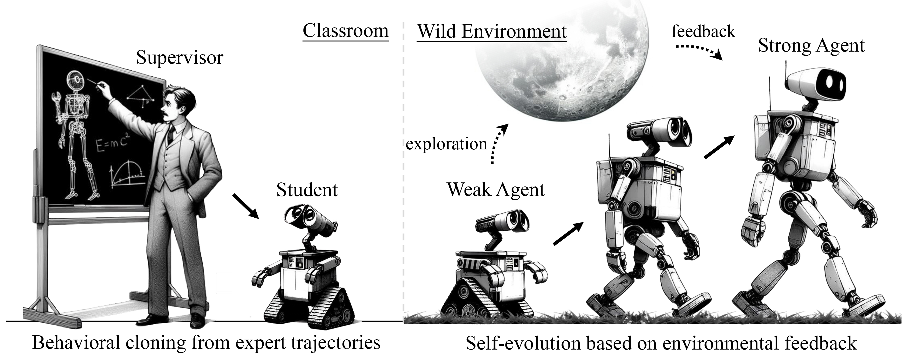
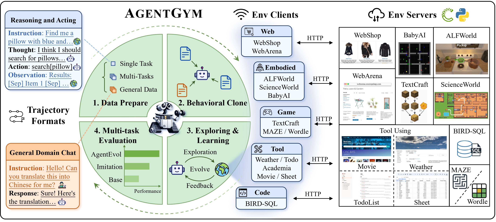
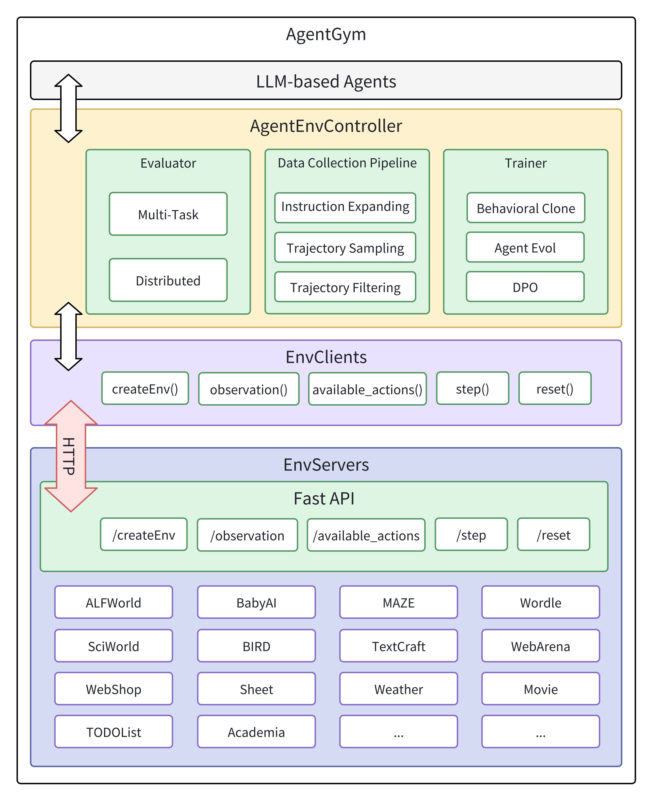
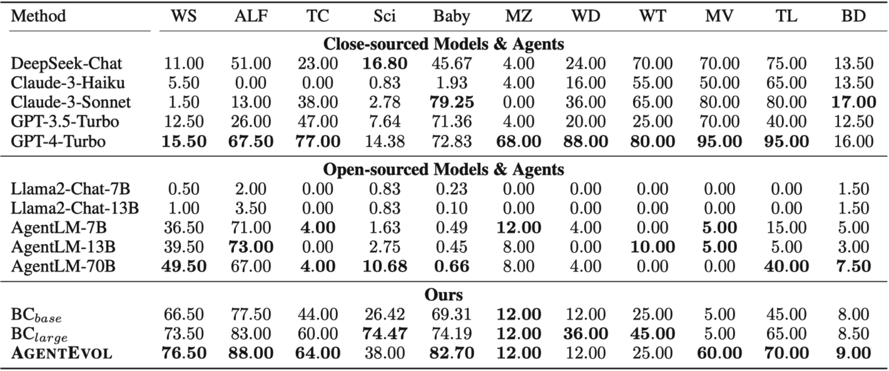

# AgentGym: Evolving Large Language Model-based Agents across Diverse Environments
<p align="center">
  📃 <a href="https://arxiv.org/abs/2406.04151" target="_blank">Paper</a > • 🌐 <a href="https://agentgym.github.io/" target="_blank">Project Page</a > • 🤗 <a href="https://huggingface.co/datasets/AgentGym/AgentTraj-L" target="_blank">AgentTraj-L</a > • 🤗 <a href="https://huggingface.co/datasets/AgentGym/AgentEval" target="_blank">AgentEval</a > • 🤗 <a href="https://huggingface.co/AgentGym/AgentEvol-7B" target="_blank">Model (AgentEvol-7B)</a ><br>
</p >

## 🔔 News

- 🥳 [2024/06/07] Our paper is released on arXiv: [AgentGym: Evolving Large Language Model-based Agents across Diverse Environments](https://arxiv.org/abs/2406.04151) !
- 🤖 [2024/06/06] Our model is available on Hugging Face: [AgentEvol-7B](https://huggingface.co/AgentGym/AgentEvol-7B).
- 💥 [2024/06/06] Our trajectory set and benchmark are available on Hugging Face: [AgentTraj-L](https://huggingface.co/datasets/AgentGym/AgentTraj-L), [AgentEval](https://huggingface.co/datasets/AgentGym/AgentEval).
- ✨ [2024/06/06] The AgentGym suite is released, including the platform code, dataset, benchmark, and training implementations! We welcome contributions for more agent environments and others from the community!

<div align=center></div>

## 🌟 Introduction

Building generalist agents that can handle diverse tasks and evolve themselves across different environments is a long-term goal in the AI community. Large language models (LLMs) are considered a promising foundation to build such agents due to their generalized capabilities. 

**AgentGym** is a new framework featuring a variety of environments and tasks for broad, real-time, uniformat, and concurrent agent exploration. It is designed to help the community easily evaluate and develop generally-capable LLM-based agents. It also includes a high-quality trajectory set **AgentTraj** and a benchmark suite **AgentEval**. We also propose a novel method, **AgentEvol**, to investigate the potential of agent self-evolution beyond previously seen data across tasks and environments. Experimental results show that the evolved agents can achieve results comparable to SOTA models. 

<div align=center></div>

## 🎁 AgentGym Suite

AgentGym is a framework designed to help the community easily evaluate and develop generally-capable LLM-based agents. It features diverse interactive environments and tasks with a unified format, i.e., ReAct format. It supports real-time feedback and concurrency, and is easily scalable. It includes 14 environments across web navigating, text games, house-holding tasks, digital games, embodied tasks, tool-using and programming.

| Environment | Traj | Eval | Original Repo                                                | EnvServer                                                    |
| ----------- | ---- | ---- | ------------------------------------------------------------ | ------------------------------------------------------------ |
| WebShop     | 3930 | 200  | [WebShop-Repo](https://github.com/princeton-nlp/WebShop)     | [agentenv-webshop](https://github.com/WooooDyy/AgentGym/tree/main/agentenv-webshop) |
| WebArena    | 0    | 20   | [WebArena](https://github.com/web-arena-x/webarena)          | [agentenv-webarena](https://github.com/WooooDyy/AgentGym/tree/main/agentenv-webarena) |
| MAZE        | 215  | 25   | [MAZE-Repo](https://github.com/abdulhaim/LMRL-Gym)           | [agentenv-lmrlgym](https://github.com/WooooDyy/AgentGym/tree/main/agentenv-lmrlgym) |
| Wordle      | 955  | 25   | [Wordle-Repo](https://github.com/abdulhaim/LMRL-Gym)         | [agentenv-lmrlgym](https://github.com/WooooDyy/AgentGym/tree/main/agentenv-lmrlgym) |
| ALFWorld    | 2420 | 200  | [ALFWorld-Repo](https://github.com/alfworld/alfworld)        | [agentenv-alfworld](https://github.com/WooooDyy/AgentGym/tree/main/agentenv-alfworld) |
| SciWorld    | 2120 | 200  | [SciWrold-Repo](https://github.com/allenai/ScienceWorld)     | [agentenv-sciworld](https://github.com/WooooDyy/AgentGym/tree/main/agentenv-sciworld) |
| BabyAI      | 810  | 90   | [BabyAI-Repo](https://github.com/mila-iqia/babyai)           | [agentenv-babyai](https://github.com/WooooDyy/AgentGym/tree/main/agentenv-babyai) |
| TextCraft   | 374  | 100  | [TextCraft-Repo](https://github.com/archiki/ADaPT)           | [agentenv-textcraft](https://github.com/WooooDyy/AgentGym/tree/main/agentenv-textcraft) |
| Weather     | 311  | 20   | [Weather-Repo](https://github.com/hkust-nlp/AgentBoard)      | [agentenv-tool](https://github.com/WooooDyy/AgentGym/tree/main/agentenv-tool) |
| Movie       | 215  | 20   | [Movie-Repo](https://github.com/hkust-nlp/AgentBoard)        | [agentenv-tool](https://github.com/WooooDyy/AgentGym/tree/main/agentenv-tool) |
| Academia    | 0    | 20   | [Academia-Repo](https://github.com/hkust-nlp/AgentBoard)     | [agentenv-tool](https://github.com/WooooDyy/AgentGym/tree/main/agentenv-tool) |
| Sheet       | 0    | 20   | [Sheet-Repo](https://github.com/hkust-nlp/AgentBoard)        | [agentenv-tool](https://github.com/WooooDyy/AgentGym/tree/main/agentenv-tool) |
| TODOList    | 135  | 20   | [TODOList-Repo](https://github.com/hkust-nlp/AgentBoard)     | [agentenv-tool](https://github.com/WooooDyy/AgentGym/tree/main/agentenv-tool) |
| BIRD        | 3000 | 200  | [BIRD-Repo](https://github.com/AlibabaResearch/DAMO-ConvAI/tree/main/bird) | [agentenv-sqlgym](https://github.com/WooooDyy/AgentGym/tree/main/agentenv-sqlgym) |

### Platform

The platform architecture of AgentGym is illustrated in the following figure. In AgentGym, different environments are deployed on different servers or ports and provide encapsulated HTTP services externally. This decouples the environments from other parts. 

These services include APIs such as `/createEnv` to create an environment, `/observation` to get the current observation from the environment, `/available_actions` to get the currently available actions, `/step` to perform an action, and `/reset` to reset the environment. 

We have implemented 14 types of environments, and **developers can easily develop new environments and add them to AgentGym by encapsulating the aforementioned interfaces**. EnvClients have the responsibility of receiving services provided by the server and encapsulating them into functions for user calls. AgentController is our core component that connects the agent and the environment. It is responsible for evaluating the agent, collecting data, and training the agent.

<div align=center></div>


### Benchmark: AgentEval

The AgentEval benchmark is on Hugging Face: [AgentGym/AgentEval](https://huggingface.co/datasets/AgentGym/AgentEval).

Here is an example: 

```json
{	
  "conversations": null, 
  "item_id": "webshop_5238"
}
```


### Trajectory Set: AgentTraj

The trajectory set AgentTraj-L is available on Hugging Face: [AgentGym/AgentTraj-L](https://huggingface.co/datasets/AgentGym/AgentTraj-L). 

Here is an example: 

```json
    {
        "conversations": [
            {
                "from": "human",
                "loss": null,
                "value": "You are web shopping.\nI will give you instructions about what to do.\nYou have to follow the instructions.\nEvery round I will give you an observation and a list of available actions, you have to respond an action based on the state and instruction.\nYou can use search action if search is available.\nYou can click one of the buttons in clickables.\nAn action should be of the following structure:\nsearch[keywords]\nclick[value]\nIf the action is not valid, perform nothing.\nKeywords in search are up to you, but the value in click must be a value in the list of available actions.\nRemember that your keywords in search should be carefully designed.\nYour response should use the following format:\n\nThought:\nI think ... \n\nAction: \nclick[something]"
            },
            {
                "from": "gpt",
                "loss": false,
                "value": "Ok."
            },
            {
                "from": "human",
                "loss": null,
                "value": "WebShop [SEP] Instruction: [SEP] Find me men's shorts with elastic waist, classic fit, short sleeve for gym workout with color: navy, and size: x-large, and price lower than 50.00 dollars [SEP] Search"
            },
            {
                "from": "gpt",
                "loss": true,
                "value": "Thought:\nI think I should use the search bar to look for the shorts that match the given requirements.\n\nAction:\nsearch[men's shorts elastic waist classic fit short sleeve gym workout navy x-large price < 50.00]"
            },
	...(more interactions)
           {
                "from": "gpt",
                "loss": true,
                "value": "Thought:\nI think I have found the right product that matches all the requirements. It's time to buy it.\n\nAction:\nclick[Buy Now]"
            }
        ],
        "item_id": "webshop_6"
    },
```


## 🛠 Usage & Quick Start

This project contains the `agentenv` python package and the integrated environments.

### Setup agentenv pacakage

#### from PyPI

```sh
pip install agentenv
```

#### from Source

```sh
git clone --recursive https://github.com/WooooDyy/AgentGym
cd ./AgentGym

cd agentenv
pip install -e .
```

Depending on which environments you want to use, `cd` into the corresponding `agentenv-*` folder and follow the `README.md` inside.


### Tutorials

- Evaluation: [01-evaluation](https://github.com/WooooDyy/AgentGym/blob/main/docs/tutorials/en/01-evaluation.md)
- Behavioral Cloning: [02-behavioral-cloning](https://github.com/WooooDyy/AgentGym/blob/main/docs/tutorials/en/02-behavioral-cloning.md)
- AgentEvol: [03-AgentEvol](https://github.com/WooooDyy/AgentGym/blob/main/docs/tutorials/en/03-AgentEvol.md)

### Examples

- See [AgentGym/agentenv/examples](https://github.com/WooooDyy/AgentGym/tree/main/agentenv/examples)

## Main Experimental Results

<div align=center></div>

## 📧 Contact
- zhxi22@m.fudan.edu.cn

## 🔖 Citation
```
@misc{xi2024agentgym,
      title={AgentGym: Evolving Large Language Model-based Agents across Diverse Environments}, 
      author={Zhiheng Xi and Yiwen Ding and Wenxiang Chen and Boyang Hong and Honglin Guo and Junzhe Wang and Dingwen Yang and Chenyang Liao and Xin Guo and Wei He and Songyang Gao and Lu Chen and Rui Zheng and Yicheng Zou and Tao Gui and Qi Zhang and Xipeng Qiu and Xuanjing Huang and Zuxuan Wu and Yu-Gang Jiang},
      year={2024},
      eprint={2406.04151},
      archivePrefix={arXiv},
      primaryClass={cs.AI}
}
```

